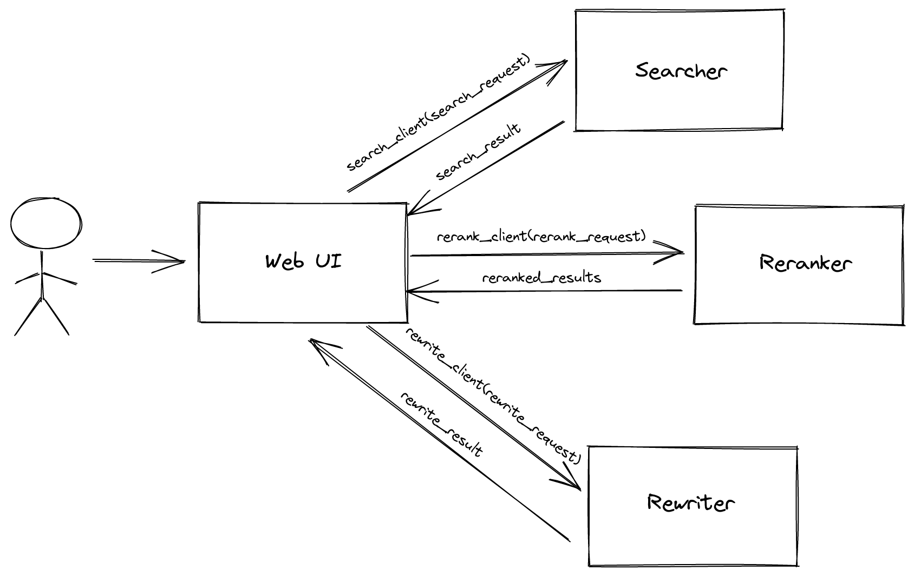

# CAsTSearcher 2.0

CAsT Searcher is a simple tool developed to help with creating the evaluation topics for the 2021 edition of the [Conversational Assistance Track](http://www.treccast.ai/). The tool allows topic developers to visually assess the behaviour of a retrieval system, ultimately making it easier to develop challenging, but interesting, topics for the Track.

CAsT Searcher is designed to be as modular and extensible as possible. It is built using a microservice architecture, with loosely coupled services that communicate through protocol buffers and grpc. 

## Architecture

CAsT Searcher is made up of four core services:

### Web UI

With the `web ui` service, one can simply issue or rewrite search queries. It is a flask application that serves as the client that the user interacts with.

### Searcher

The `searcher` service receives a search query and relevant search parameters from the `web ui` and returns a search result.

### Reranker

If one chooses, they might want to rerank the search result from the `searcher`. The `reranker` takes in a search result and outputs a reranked search result.

### Rewriter

The `rewriter` handles query rewrites. It takes in a search query along with relevant context and outputs a rewrite.

## How to Run

First, make sure to run the offline pipeline to generate the indexes the online system needs to search on. Details of how to do that can be found in the `offline` directory.

The services are dockerfied and orchestrated with docker compose. To interact with the app, run:

`docker-compose up --build`

(NOTE: Reranking is slow, if running on CPU -- especially when reranking lots of documents!)

## DEMO

You can interact with the system [here](http://3.83.54.47:5000/)

------------------------

To run with kubernetes on minikube:

1. Start minikube: `minikube start`
2. Open the minikube dashboard to monitor the app's resources: `minikube dashboard`
3. To allow minikube expose the LoadBalancer web UI service to allow access: `minikube tunnel` 
4. Mount the shared directory on minikube: `minikube mount shared:/shared`

In the `kubernetes_deplpoyment` directory, run `bash build_images.sh` to build the app's images within the minikube environment.

Then create the resources for the app with `kubectl apply -f .`

If all goes well, the endpoint to access the web UI should then be available in the minikube dashboard within the Services menu.
